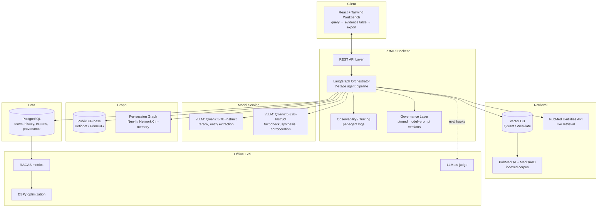
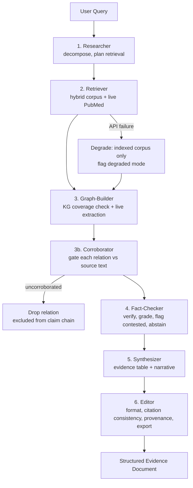

# Solace AI — High-Level Design (HLD)

> **Document type:** High-Level Design / Architecture Blueprint
> **Product:** Solace AI — Clinical-Evidence Research Assistant
> **Status:** Draft v1.0
> **Date:** 2026-06-21
> **Audience:** Architects, senior engineers, PMs

---

## 1. Purpose

This document describes the **system architecture** of Solace AI: the major components, how they communicate, the data stores and external services, the high-level data flow, the technology choices, and the scalability/reliability strategy. It is the architecture blueprint; component internals are specified in the LLD.

---

## 2. Architecture Overview

Solace AI is a **multi-agent retrieval-augmented system**. A React workbench calls a FastAPI backend, which orchestrates a **7-stage LangGraph agent pipeline** over self-hosted Qwen2.5 models (served via vLLM), a hybrid dense+sparse retrieval layer, a hybrid GraphRAG layer, and live PubMed access. PostgreSQL persists durable state; a per-session graph store holds transient KG extensions.

---

## 3. Major Components

| Component | Responsibility | Technology |
|---|---|---|
| **Workbench UI** | Structured query input, evidence-table rendering, export panel | React + Tailwind |
| **API layer** | Request handling, auth, job lifecycle | FastAPI (Python) |
| **Orchestrator** | Drives 7-stage agent pipeline; manages state graph & checkpoints | LangGraph |
| **Model serving (7B)** | High-volume/low-reasoning: rerank, entity/relation extraction | Qwen2.5-7B-Instruct on vLLM |
| **Model serving (32B)** | Reasoning-heavy: fact-check, synthesis, corroboration | Qwen2.5-32B-Instruct on vLLM |
| **Vector DB** | Hybrid dense+sparse retrieval over indexed corpora | Qdrant / Weaviate |
| **Indexed corpus** | PubMedQA + MedQuAD embeddings | (in vector DB) |
| **Live retrieval** | Fresh PubMed access with rate-limit handling | E-utilities API |
| **Public KG base** | Biological base schema for multi-hop reasoning | Hetionet / PrimeKG |
| **Per-session graph** | Transient live KG extension (stateless) | Neo4j / in-memory NetworkX |
| **Relational store** | Users, query history, exported docs, provenance logs | PostgreSQL |
| **Observability** | Per-agent latency, token cost, retrieval/cache hit rates | Structured logging/tracing |
| **Governance** | Pinned model+prompt versions; provenance persistence | Backend layer + PG |
| **Evaluation** | Faithfulness, citation accuracy, relevancy, abstention | RAGAS, DSPy, LLM-as-judge |

---

## 4. Agent Pipeline (7 stages)

| Stage | Model | Role |
|---|---|---|
| 1. Researcher | 7B/32B | Decompose question, identify sub-questions, plan retrieval |
| 2. Retriever | 7B (rerank) | Hybrid retrieval over indexed corpus + live PubMed; degrade on failure |
| 3. Graph-Builder | 7B | KG coverage check; LLM entity/relation extraction on gaps |
| 3b. Corroborator | 32B | Verify each extracted relation against source text before use |
| 4. Fact-Checker | 32B | Verify claims, grade evidence strength, flag contested, trigger abstention |
| 5. Synthesizer | 32B | Compose evidence table + narrative from verified claims only |
| 6. Editor | 32B | Format deliverable, ensure citation consistency, attach provenance, export |

---

## 5. Data Flow

1. **Query** enters via the workbench → API → orchestrator.
2. **Decomposition** (Researcher) splits the question into sub-questions and a retrieval plan.
3. **Parallel retrieval** (Retriever): indexed corpus (vector DB) + live PubMed (E-utilities), with a **degradation path** to indexed-only on API failure.
4. **Graph coverage check** (Graph-Builder): query public KG; for gaps, perform **conditional live extraction** of entities/relations.
5. **Corroboration gate** (Corroborator): each extracted relation must clear verification against source text before downstream use; **uncorroborated relations are dropped**.
6. **Per-claim fact-checking** (Fact-Checker) against text + corroborated graph relations; grading + abstention.
7. **Synthesis** (Synthesizer) from **verified claims only**.
8. **Formatted export** with provenance (Editor).

Each agent passes **structured intermediate state** (not free text) through LangGraph's state graph, logged with **agent ID, prompt version, and timing** — enabling both RAGAS evaluation and full **audit replay** at each stage boundary.

---

## 6. Technology Stack Summary

| Layer | Choice | Rationale |
|---|---|---|
| Frontend | React + Tailwind | Structured workbench, not a chat window |
| Backend | Python / FastAPI | Async API, strong ML ecosystem |
| Orchestration | LangGraph | Stateful multi-agent graphs with checkpointing |
| LLM serving | vLLM (Qwen2.5 7B + 32B) | Self-hosted, no paid-API dependency; tiered by reasoning load |
| Retrieval | Hybrid dense+sparse, Qdrant/Weaviate | Recall + precision over biomedical corpora |
| Live data | PubMed E-utilities | Coverage beyond indexed snapshot |
| Graph base | Hetionet / PrimeKG | Public biomedical KG schema |
| Session graph | Neo4j / NetworkX | Transient, stateless per-query extension |
| Relational DB | PostgreSQL | History, accounts, exports, provenance |
| Eval | RAGAS, DSPy, LLM-as-judge | Faithfulness/citation/abstention + prompt optimization |
| Cloud | **Microsoft Azure (Student subscription)** | Single-cloud target; see §6.1 for service mapping and §7.5 for the GPU-quota constraint |

### 6.1 Azure service mapping

| Logical component | Azure service |
|---|---|
| React workbench (static) | Azure Static Web Apps (or Blob static hosting + CDN) |
| FastAPI backend (container) | Azure Container Apps (or App Service for Containers) |
| Container images | Azure Container Registry (ACR) |
| vLLM Qwen2.5 serving (GPU) | Azure VM **NC-series** GPU (e.g. NCas T4 / NCads A100) — *quota-gated, see §7.5* |
| PostgreSQL | Azure Database for PostgreSQL (Flexible Server) |
| Vector DB (Qdrant/Weaviate) | Container on Azure Container Apps / AKS, or self-managed VM |
| Exported documents (blobs) | Azure Blob Storage |
| Secrets | Azure Key Vault |
| Observability | Azure Monitor + Application Insights + Log Analytics |
| CI/CD | GitHub Actions (or Azure DevOps Pipelines) |

---

## 7. Scalability & Reliability Strategy

### 7.1 Scalability

- **Tiered model serving:** route low-reasoning stages to 7B, reasoning-heavy stages to 32B — controls GPU load and cost.
- **Parallel retrieval:** corpus and live API queried concurrently.
- **Vector DB** scales horizontally for corpus growth.
- **Stateless session graph:** no cross-session graph state to scale or synchronize.

### 7.2 Reliability — failure-mode handling

| Failure mode | Strategy |
|---|---|
| **Retrieval failure** (PubMed down/rate-limited) | Fall back to indexed PubMedQA/MedQuAD only; flag *"live retrieval unavailable, results based on indexed corpus."* |
| **Graph coverage gap** | Graph-Builder attempts live extraction; if corroboration fails, fall back to flat vector RAG (no multi-hop) for that sub-question. |
| **Agent timeout / partial failure** | Each stage's output checkpointed in LangGraph state — downstream failure does not require re-running upstream stages. |
| **Latency / cost** | No hard budget this capstone; p50/p95 and per-query GPU cost measured and reported post-hoc as a known limitation. |

### 7.3 Observability

Per-agent tracing of **latency, token cost, retrieval hit rate, cache hit rate** via structured logging — **not optional** given pipeline depth. Feeds both operational monitoring and RAGAS evaluation.

### 7.4 Governance

- **Pinned model + prompt versions** per evaluated run for reproducibility.
- **Per-claim provenance metadata** persisted alongside every output for audit and debugging.

### 7.5 Azure GPU constraint (critical infra reality)

Self-hosted Qwen2.5-32B is the largest infrastructure risk under an **Azure Student subscription**:

- Azure for Students provides a **limited credit grant and no GPU (NC/ND/NV) quota by default** — GPU VM families require a quota-increase request that student/free tiers frequently cannot obtain, and the credit would not sustain continuous A100-class inference regardless.
- Qwen2.5-32B in FP16 needs ~64 GB+ of GPU memory; in 4-bit (AWQ/GPTQ) it fits in ~20–24 GB.

**Mitigation ladder (in order of preference):**

1. **Upgrade the subscription to Pay-As-You-Go** and file a GPU quota request (NCas T4 v3 or NCads A100 v4); use **Spot/low-priority VMs** to cut cost.
2. Use **institutional Azure credits / Azure Educator grant** if the institution provides them (assumed available per project constraints).
3. **Quantize** the 32B model (4-bit AWQ) to fit a single mid-tier GPU (e.g., one T4/A10), trading a small precision margin tracked via RAGAS.
4. **Tier down** reasoning-light stages to 7B aggressively to minimize 32B GPU-hours.

This constraint is documented here, in PRD NFR-10, and operationalized in the Ops doc (§2, §8).

---

## 8. Key Architectural Decisions

| Decision | Choice | Trade-off |
|---|---|---|
| Output shape | Structured deliverable, not chat | More engineering; far higher defensibility |
| Models | Self-hosted Qwen2.5 | No API cost; must manage GPU + precision |
| Graph | Hybrid public KG + live extension | Coverage vs. statefulness; chose stateless simplicity |
| Hallucination control | Hard corroboration gate (drop, not down-weight) | Stricter; preserves claim-chain integrity |
| Performance | Correctness over latency/cost | Slower/costlier; correct and defensible |

---

> **Next**: Reply "continue" to generate the next document.
