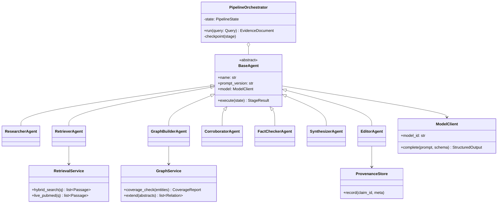
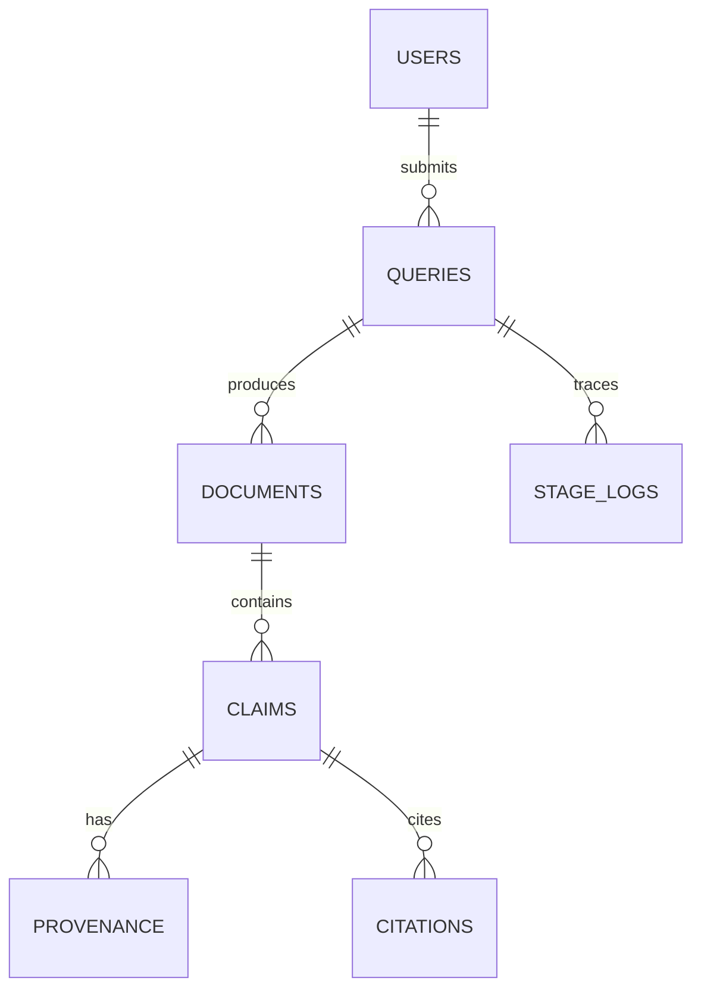

# Solace AI — Low-Level Design (LLD)

> **Document type:** Low-Level Design / Detailed Implementation Plan
> **Product:** Solace AI — Clinical-Evidence Research Assistant
> **Status:** Draft v1.0
> **Date:** 2026-06-21
> **Audience:** Developers implementing the system; reviewers

---

## 1. Purpose

This document specifies the **internal design**: module/class structure, database schema, API request/response formats, the per-agent business logic and algorithms, edge-case handling, and the design patterns used. It is implementation-ready detail beneath the HLD.

---

## 2. Module / Class Structure



### Design patterns

| Pattern | Where | Why |
|---|---|---|
| **Strategy** | `ModelClient` (7B vs 32B), retrieval mode (hybrid vs degraded), reasoning mode (graph vs flat RAG) | Swap behavior per stage/condition without branching everywhere |
| **Template Method** | `BaseAgent.execute()` | Uniform logging/provenance/error-handling wrapper around per-agent logic |
| **Chain of Responsibility** | LangGraph stage sequence | Each stage processes structured state and passes it on |
| **Factory** | Agent + ModelClient construction | Centralize model/prompt-version pinning |
| **Gate / Guard** | Corroborator | Hard filter before relations enter the claim chain |
| **Circuit Breaker / Fallback** | Retriever (live→indexed), Graph (graph→flat RAG) | Graceful degradation |

---

## 3. Pipeline State (shared structured object)

```python
class PipelineState(BaseModel):
    query_id: UUID
    raw_query: str
    sub_questions: list[SubQuestion] = []
    passages: list[Passage] = []          # retrieved evidence
    retrieval_mode: Literal["hybrid", "degraded"] = "hybrid"
    graph_relations: list[Relation] = []  # corroborated only
    reasoning_mode: Literal["graph", "flat_rag"] = "graph"
    candidate_claims: list[Claim] = []
    verified_claims: list[Claim] = []
    abstentions: list[Abstention] = []
    provenance: list[ProvenanceRecord] = []
    flags: list[str] = []                 # e.g. "live_retrieval_unavailable"
```

State is **checkpointed after each stage** in LangGraph so a downstream failure never forces re-running upstream stages.

---

## 4. Database Schema (PostgreSQL)



### Tables

```sql
CREATE TABLE users (
    id              UUID PRIMARY KEY DEFAULT gen_random_uuid(),
    email           CITEXT UNIQUE NOT NULL,
    display_name    TEXT,
    created_at      TIMESTAMPTZ NOT NULL DEFAULT now()
);

CREATE TABLE queries (
    id              UUID PRIMARY KEY DEFAULT gen_random_uuid(),
    user_id         UUID NOT NULL REFERENCES users(id),
    raw_query       TEXT NOT NULL,
    status          TEXT NOT NULL CHECK (status IN
                      ('queued','running','completed','failed','degraded')),
    retrieval_mode  TEXT NOT NULL DEFAULT 'hybrid',
    reasoning_mode  TEXT NOT NULL DEFAULT 'graph',
    created_at      TIMESTAMPTZ NOT NULL DEFAULT now(),
    completed_at    TIMESTAMPTZ
);
CREATE INDEX idx_queries_user ON queries(user_id, created_at DESC);

CREATE TABLE documents (
    id              UUID PRIMARY KEY DEFAULT gen_random_uuid(),
    query_id        UUID NOT NULL REFERENCES queries(id),
    format          TEXT NOT NULL CHECK (format IN ('markdown','pdf')),
    storage_uri     TEXT NOT NULL,
    created_at      TIMESTAMPTZ NOT NULL DEFAULT now()
);
CREATE INDEX idx_documents_query ON documents(query_id);

CREATE TABLE claims (
    id              UUID PRIMARY KEY DEFAULT gen_random_uuid(),
    document_id     UUID NOT NULL REFERENCES documents(id),
    claim_text      TEXT NOT NULL,
    evidence_strength TEXT NOT NULL CHECK (evidence_strength IN
                      ('strong','moderate','weak','contested')),
    consensus_label TEXT NOT NULL CHECK (consensus_label IN
                      ('consensus','contested','insufficient')),
    is_abstention   BOOLEAN NOT NULL DEFAULT false
);
CREATE INDEX idx_claims_document ON claims(document_id);

CREATE TABLE citations (
    id              UUID PRIMARY KEY DEFAULT gen_random_uuid(),
    claim_id        UUID NOT NULL REFERENCES claims(id),
    source_type     TEXT NOT NULL CHECK (source_type IN
                      ('pubmed','pubmedqa','medquad')),
    source_ref      TEXT NOT NULL,         -- e.g. PMID
    snippet         TEXT NOT NULL,         -- supporting source text
    UNIQUE (claim_id, source_type, source_ref)
);
CREATE INDEX idx_citations_claim ON citations(claim_id);

CREATE TABLE provenance (
    id              UUID PRIMARY KEY DEFAULT gen_random_uuid(),
    claim_id        UUID NOT NULL REFERENCES claims(id),
    agent_id        TEXT NOT NULL,
    prompt_version  TEXT NOT NULL,
    model_id        TEXT NOT NULL,
    retrieval_pass  INT  NOT NULL,
    created_at      TIMESTAMPTZ NOT NULL DEFAULT now()
);
CREATE INDEX idx_provenance_claim ON provenance(claim_id);

CREATE TABLE stage_logs (
    id              UUID PRIMARY KEY DEFAULT gen_random_uuid(),
    query_id        UUID NOT NULL REFERENCES queries(id),
    agent_id        TEXT NOT NULL,
    prompt_version  TEXT NOT NULL,
    latency_ms      INT,
    token_cost      INT,
    retrieval_hits  INT,
    cache_hit       BOOLEAN,
    status          TEXT NOT NULL,
    created_at      TIMESTAMPTZ NOT NULL DEFAULT now()
);
CREATE INDEX idx_stage_logs_query ON stage_logs(query_id, created_at);
```

> **Note:** The per-session graph (Neo4j / NetworkX) is **not persisted** — stateless by design. No table backs it.

---

## 5. API Specification

### 5.1 Submit a query

`POST /api/v1/queries`

```json
{
  "query": "Does metformin reduce cancer incidence in type 2 diabetes patients?"
}
```

**201 Created**
```json
{
  "query_id": "9b1c...",
  "status": "queued"
}
```

| Status | Meaning |
|---|---|
| 201 | Query accepted, pipeline queued |
| 400 | Empty/invalid query |
| 401 | Unauthenticated |
| 429 | Rate limited |

### 5.2 Poll query status

`GET /api/v1/queries/{query_id}`

**200 OK**
```json
{
  "query_id": "9b1c...",
  "status": "running",
  "current_stage": "fact_checker",
  "flags": ["live_retrieval_unavailable"]
}
```

### 5.3 Fetch result

`GET /api/v1/queries/{query_id}/document`

**200 OK**
```json
{
  "query_id": "9b1c...",
  "status": "completed",
  "retrieval_mode": "degraded",
  "reasoning_mode": "graph",
  "evidence_table": [
    {
      "claim": "Metformin is associated with reduced cancer incidence in T2DM.",
      "evidence_strength": "moderate",
      "consensus_label": "contested",
      "citations": [
        {"source_type": "pubmed", "source_ref": "PMID:12345678",
         "snippet": "...observational cohorts report a 20-30% reduction..."}
      ],
      "provenance": {
        "agent_id": "fact_checker", "prompt_version": "fc-v3",
        "model_id": "qwen2.5-32b-instruct", "retrieval_pass": 2
      }
    }
  ],
  "abstentions": [
    {"sub_question": "Effect on pancreatic cancer specifically",
     "reason": "insufficient corroborated evidence in corpus"}
  ],
  "narrative_md": "## Synthesis\n..."
}
```

### 5.4 Export

`POST /api/v1/queries/{query_id}/export`  body: `{"format": "pdf"}` → **200** `{ "storage_uri": "https://<account>.blob.core.windows.net/exports/..." }`

> **Storage:** exported documents are written to **Azure Blob Storage**; `documents.storage_uri` holds the blob URL (SAS-scoped for download).

---

## 6. Per-Agent Logic & Algorithms

### 6.1 Researcher
- **Input:** raw query. **Output:** `sub_questions[]` + retrieval plan.
- Decompose into atomic, answerable sub-questions; tag each with target entities for graph coverage.

### 6.2 Retriever (with degradation)
```
function retrieve(sub_q):
    dense = vector_db.dense_search(sub_q, k=K)
    sparse = vector_db.sparse_search(sub_q, k=K)
    fused = reciprocal_rank_fusion(dense, sparse)
    try:
        live = pubmed_eutils(sub_q)            # rate-limit aware
        passages = rerank_7B(fused + live)
        mode = "hybrid"
    except (PubMedDown, RateLimited):
        passages = rerank_7B(fused)
        mode = "degraded"
        state.flags.add("live_retrieval_unavailable")
    return passages, mode
```

### 6.3 Graph-Builder
```
report = public_kg.coverage_check(entities)
for gap in report.uncovered:
    relations += extract_relations_7B(passages_for(gap))   # LLM extraction
# relations are CANDIDATES — not yet usable
```

### 6.4 Corroborator (hard gate)
```
corroborated = []
for r in candidate_relations:
    if verify_relation_against_source_32B(r, r.source_snippet):
        corroborated.append(r)
    # else: DROPPED — not down-weighted, not added
state.graph_relations = corroborated
if report.uncovered and not corroborated_for(sub_q):
    state.reasoning_mode = "flat_rag"     # fallback for that sub-question
```

### 6.5 Fact-Checker
```
for candidate in candidate_claims:
    support = gather_support(candidate, passages, state.graph_relations)
    grade = grade_strength_32B(candidate, support)   # strong/moderate/weak/contested
    if support_insufficient(support):
        state.abstentions.add(Abstention(sub_q, reason="insufficient evidence"))
    else:
        candidate.evidence_strength = grade
        candidate.consensus_label = consensus_or_contested(support)
        state.verified_claims.add(candidate)
```

### 6.6 Synthesizer
- Compose evidence table + narrative **from `verified_claims` only**. Never reads candidate or dropped material.

### 6.7 Editor
- Format Markdown/PDF, enforce citation consistency, attach provenance per claim, persist to `documents`, export.

---

## 7. Edge-Case Handling

| Edge case | Behavior |
|---|---|
| No evidence found for a sub-question | Emit explicit abstention; no fabricated citation |
| Conflicting sources | Grade `contested`; surface both sides with citations |
| PubMed API down/rate-limited | Degrade to indexed corpus; set `live_retrieval_unavailable` flag |
| Graph gap + corroboration fails | Fall back to flat vector RAG for that sub-question |
| Extracted relation unsupported by text | Drop entirely (corroboration gate) |
| Agent timeout / partial failure | Resume from last checkpointed stage |
| Duplicate citations | DB unique constraint `(claim_id, source_type, source_ref)` |
| Thin but non-empty evidence | Hedge with `weak` grade + caveat, or abstain per threshold |

---

## 8. Configuration & Governance

```yaml
models:
  small: qwen2.5-7b-instruct      # rerank, entity/relation extraction
  large: qwen2.5-32b-instruct     # corroboration, fact-check, synthesis, editor
prompts:                          # versions pinned per evaluated run
  researcher: r-v2
  retriever_rerank: rr-v1
  graph_builder: gb-v2
  corroborator: cb-v3
  fact_checker: fc-v3
  synthesizer: sy-v2
  editor: ed-v1
retrieval:
  top_k: 50
  fusion: reciprocal_rank
abstention:
  min_corroborated_support: 1
golden_set: pubmedqa            # locked regression
```

Every output row in `provenance` records `agent_id`, `prompt_version`, `model_id`, `retrieval_pass` — enabling full **audit replay**.

---

> **Next**: Reply "continue" to generate the next document.
