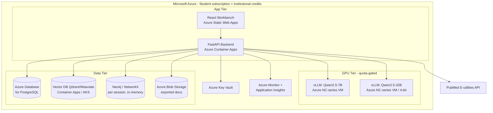
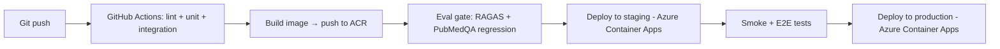

# Solace AI — Ops / Deployment Document

> **Document type:** Operations & Deployment Plan
> **Product:** Solace AI — Clinical-Evidence Research Assistant
> **Status:** Draft v1.0
> **Date:** 2026-06-21
> **Audience:** DevOps, SRE, backend engineers, reviewers

---

## 1. Purpose

Describe **how Solace AI is deployed, monitored, rolled out, feature-flagged, and rolled back**, plus the service-level objectives (SLOs) tracked. Reflects the capstone reality: **correctness over latency/cost**, with performance measured and reported rather than engineered against a hard target.

---

## 2. Deployment Topology

| Tier | Component | Azure service |
|---|---|---|
| App | React workbench | Azure Static Web Apps (or Blob static site + CDN) |
| App | FastAPI backend | Azure Container Apps (or App Service for Containers) |
| App | Container images | Azure Container Registry (ACR) |
| GPU | vLLM Qwen2.5-7B + 32B | Azure VM **NC-series** GPU (Spot/low-priority where possible) — *quota-gated, see §2.1* |
| Data | PostgreSQL | Azure Database for PostgreSQL (Flexible Server) |
| Data | Vector DB (Qdrant/Weaviate) | Container on Azure Container Apps / AKS |
| Data | Session graph | In-memory (stateless) |
| Data | Exported documents | Azure Blob Storage |
| Security | Secrets | Azure Key Vault |
| Observability | Logs + metrics + traces | Azure Monitor + Application Insights + Log Analytics |
| External | PubMed E-utilities | Third-party API |

### 2.1 Azure Student subscription — GPU constraint & plan

> **This is the dominant operational risk.** Azure for Students ships with **limited credit and no GPU (NC/ND/NV) quota by default**; sustained Qwen2.5-32B inference is not feasible on the base student tier.

**Operational plan (in order):**

1. **Upgrade to Pay-As-You-Go** and file a **GPU quota-increase request** (NCas T4 v3 for 7B / quantized 32B; NCads A100 v4 if granted).
2. Run GPU VMs as **Spot / low-priority** to minimize burn; **deallocate when idle** (capstone has no uptime SLA).
3. Use **institutional / Azure Educator credits** for sustained GPU hours where the student credit is insufficient.
4. If quota for large GPUs is denied, **serve 4-bit (AWQ) Qwen2.5-32B** on a single T4/A10-class GPU; track any precision delta via RAGAS.
5. Keep 7B and 32B on **separate VMs** so the expensive 32B node can be stopped independently between eval runs.

---

## 3. Environments

| Environment | Purpose | Notes |
|---|---|---|
| **Local/dev** | Development, unit/integration tests | Mock models or small 7B; seeded corpus |
| **Staging** | Full pipeline, eval runs, golden-set regression | Mirrors prod model serving |
| **Production** | Deployed capstone system | GPU-backed Qwen2.5 serving |

---

## 4. Build & Deployment Pipeline

- **CI/CD:** GitHub Actions (or Azure DevOps Pipelines); images pushed to **Azure Container Registry**, deployed to **Azure Container Apps**.
- **Eval gate:** deployment blocked on **PubMedQA regression** (no regression) and RAGAS capture.
- **Model + prompt versions pinned** per deployed/evaluated run (governance requirement) — recorded in release metadata.
- **GPU VMs are deployed separately** from the app tier (Container Apps cannot host the GPU workload); the vLLM VMs are provisioned via IaC and started/stopped around eval and demo windows to conserve credit.

---

## 5. Configuration & Governance

| Item | Mechanism |
|---|---|
| Model IDs (7B/32B) | Config file / env; pinned per release |
| Prompt versions | Pinned per evaluated run; recorded in `provenance` |
| Secrets (DB, API keys) | **Azure Key Vault**; injected as env at runtime, never in repo |
| Feature flags | Config-driven (see §6) |
| Golden set | PubMedQA, locked |

Every production run persists **per-claim provenance** (agent, prompt version, model, retrieval pass) for audit replay.

---

## 6. Feature Flags & Rollout

| Flag | Controls | Default |
|---|---|---|
| `enable_live_pubmed` | Live E-utilities retrieval vs indexed-only | on |
| `enable_graph_reasoning` | Multi-hop GraphRAG vs flat vector RAG | on |
| `enable_live_graph_extension` | Per-query graph extension + corroboration | on |
| `model_tier_large` | Use 32B for reasoning stages | on |
| `abstention_threshold` | Min corroborated support to answer | tuned |

**Rollout strategy:** progressive enablement — start indexed-only + flat RAG, then enable live retrieval, then graph reasoning, then live graph extension. Each step validated against the golden set before the next flag flips.

---

## 7. Monitoring & Observability

Per-agent tracing is **mandatory** given pipeline depth.

| Signal | Per-agent metric | Why |
|---|---|---|
| Latency | Stage latency (ms), p50/p95 | Measure & report (not gated) |
| Cost | Token cost, GPU utilization | Per-query cost reporting |
| Retrieval | Retrieval hit rate | Quality of grounding |
| Cache | Cache hit rate | Efficiency |
| Reliability | Stage success/failure, degradation events | Resilience tracking |
| Quality | RAGAS faithfulness/citation (offline) | Regression watch |

**Tooling:** structured logs and traces flow to **Azure Monitor / Application Insights / Log Analytics**; dashboards built as Azure Workbooks, alerts via Azure Monitor alert rules.

**Dashboards:** pipeline funnel (per-stage latency/cost), degradation-event rate, abstention rate, golden-set regression trend, **Azure credit/cost burn (Cost Management)**.

**Alerts:** PubMed API failure spike → degraded-mode rate alarm; GPU saturation; stage failure rate; DB errors; **Azure budget threshold (Cost Management budget alert) to protect limited student credit**.

---

## 8. SLOs (Tracked, Capstone-Appropriate)

> Latency/cost are **measured and reported**, not contractual targets — correctness is prioritized for this capstone.

| SLO | Target | Notes |
|---|---|---|
| Availability (app tier) | Best-effort, reported | Single-region capstone deployment |
| Pipeline completion rate | High; degradations flagged, not failed | Degraded mode counts as completed-with-flag |
| Provenance completeness | 100% | Hard correctness requirement |
| Golden-set regression | No regression | Release gate |
| p50/p95 latency, per-query GPU cost | **Measured & reported** | Documented as known limitation |

---

## 9. Failure Modes & Operational Response

| Failure | Detection | Automated response | Operator action |
|---|---|---|---|
| PubMed API down/rate-limited | Retrieval errors | Degrade to indexed corpus; flag output | Monitor degraded-mode rate |
| Graph coverage gap + corroboration fail | Corroborator drops all | Fall back to flat vector RAG | Review coverage gaps |
| Agent timeout/partial failure | Stage error | Resume from LangGraph checkpoint | Inspect stage logs |
| GPU saturation | Utilization alarm | Queue/throttle requests | Scale GPU / shed load |
| DB unavailable | Connection errors | Fail fast; retry with backoff | Restore DB |
| **Azure credit exhausted / GPU quota denied** | Cost Management budget alert; quota error | App tier stays up; GPU stages pause | Deallocate idle GPU VM; switch to 4-bit 32B on smaller GPU; request quota / institutional credits |

---

## 10. Rollback Plan

| Scenario | Rollback action |
|---|---|
| Bad release (quality regression) | Redeploy previous container image + **previous pinned model/prompt versions** |
| Prompt regression | Revert to prior pinned prompt version (recorded in release metadata) |
| Model regression | Revert model tier/ID config; redeploy |
| Schema migration issue | Reversible migrations; roll back migration step |
| Feature-flag-induced failure | Flip the offending flag off (no redeploy needed) |

Because prompt/model versions are **pinned and recorded**, rollback restores a known-good, reproducible configuration.

---

## 11. Backup & Data Handling

- **Azure Database for PostgreSQL** (users, history, exports, provenance): automated backups (Flexible Server point-in-time restore).
- **Azure Blob Storage** (exported documents): durable by default; lifecycle policy optional.
- **Vector DB**: rebuildable from source corpora (PubMedQA/MedQuAD) — re-index procedure documented.
- **Session graph**: **stateless** — nothing to back up; discarded after each query (data-governance simplicity).

---

## 12. Runbook Quick Reference

| Symptom | First check |
|---|---|
| All outputs in degraded mode | PubMed API status / rate limits |
| Many abstentions | Corpus coverage; abstention threshold; retrieval hit rate |
| High latency | GPU utilization; 32B stage queue depth |
| Missing provenance | Editor stage logs; governance config |
| Multi-hop not used | `enable_graph_reasoning` flag; coverage check; corroboration failures |

---

> **Next**: Reply "continue" to generate the next document.
