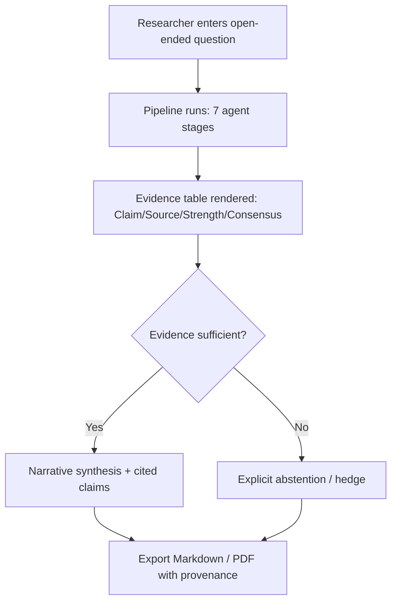

# Solace AI — Product Requirements Document (PRD)

> **Document type:** Product Requirements Document
> **Product:** Solace AI — Clinical-Evidence Research Assistant
> **Status:** Draft v1.0
> **Date:** 2026-06-21
> **Audience:** Product, engineering, design, QA, stakeholders

---

## 1. Purpose & Scope

This PRD defines **what Solace AI does from the user's point of view** — its features, user stories, success metrics, and constraints. It is the contract between product intent and engineering execution.

**In scope:** A web-based research workbench that turns an open-ended biomedical question into a structured, fully-cited, evidence-graded literature review document.

**Out of scope (this version):** custom KG construction over ChEMBL/UniProt; persistent cross-session graph store; user-facing corpus-bias disclosure; hard latency/cost SLAs.

---

## 2. Product Summary

Solace AI is a **multi-agent clinical-evidence research assistant**. A researcher submits an open-ended biomedical question; a 7-stage agent pipeline retrieves, reasons over, fact-checks, and synthesizes evidence into a **structured deliverable** with per-claim citations, evidence grading, and a full provenance trail.

---

## 3. Goals & Success Metrics

### 3.1 Product goals

| # | Goal |
|---|---|
| G1 | Produce a structured, exportable, fully-cited evidence document from one query |
| G2 | Grade evidence strength on every claim and flag contested findings |
| G3 | Abstain explicitly when evidence is insufficient (no fabrication) |
| G4 | Provide a per-claim audit trail (provenance) |
| G5 | Support open-ended query scope (no fixed taxonomy) |

### 3.2 Success metrics

| Metric | Definition | Target (capstone) |
|---|---|---|
| **Faithfulness** (RAGAS) | Claims supported by retrieved source text | Tracked per sprint; trend ↑ |
| **Citation accuracy** (RAGAS) | Citations point to the correct supporting source | Tracked per sprint; trend ↑ |
| **Answer relevancy** (RAGAS) | Output addresses the posed question | Tracked per sprint |
| **Calibrated abstention** | System abstains when evidence is thin, answers when sufficient | Measured on PubMedQA known-answer cases |
| **PubMedQA regression** | Accuracy on locked golden set | No regression sprint-over-sprint |
| **Provenance completeness** | % of claims with full provenance metadata | 100% |
| **Hallucinated-relation rate** | Graph relations entering claim chain without source support | ~0% (corroboration gate) |

> Latency (p50/p95) and per-query GPU cost are **measured and reported post-hoc**, not targeted.

---

## 4. Personas

### 4.1 Priya — PhD Student
- Writing a thesis chapter; must defend every claim to her committee.
- **Need:** cited, gradeable synthesis she can drop into a chapter and defend.

### 4.2 Arjun — PG Researcher
- Scoping a new project and supporting a grant proposal under deadline.
- **Need:** rigorous coverage of prior work fast, with contested findings surfaced.

### 4.3 Dr. Mehta — Lab Lead / PI
- Validating a hypothesis direction before committing lab resources.
- **Need:** trustworthy, auditable evidence summary; wants to see *why* a claim is graded as it is.

---

## 5. User Stories & Requirements

### Epic A — Query & Workbench

| ID | User story | Priority |
|---|---|---|
| A1 | As a researcher, I can enter an open-ended biomedical question into a structured workbench (not a chat box). | P0 |
| A2 | As a researcher, I can see pipeline progress per stage (researcher → … → editor). | P1 |
| A3 | As a researcher, I can view intermediate state for transparency. | P2 |

**Acceptance (A1):** Workbench accepts free-text question; triggers pipeline; shows a non-chat, structured layout (query input → evidence table → export panel).

### Epic B — Evidence Table

| ID | User story | Priority |
|---|---|---|
| B1 | As a researcher, I receive a structured evidence table: **Claim \| Source \| Evidence Strength \| Consensus/Contested**. | P0 |
| B2 | As a researcher, each claim links to the exact supporting source. | P0 |
| B3 | As a researcher, I can see which claims are contested and why. | P1 |

**Acceptance (B1):** Every row contains a claim, a resolvable source citation, an evidence-strength grade ∈ {strong, moderate, weak, contested}, and a consensus/contested label.

### Epic C — Evidence Grading & Abstention

| ID | User story | Priority |
|---|---|---|
| C1 | As a researcher, each claim is graded for evidence strength. | P0 |
| C2 | As a researcher, when evidence is thin the system tells me *"evidence is insufficient"* rather than guessing. | P0 |
| C3 | As a researcher, contested findings are explicitly flagged, not flattened. | P1 |

**Acceptance (C2):** On known-thin cases, output contains an explicit abstention statement; no fabricated citation is produced.

### Epic D — Multi-Hop Biological Reasoning

| ID | User story | Priority |
|---|---|---|
| D1 | As a researcher, the system can reason across biological entities (gene → protein → pathway → disease → drug). | P1 |
| D2 | As a researcher, for questions outside the pre-built KG, the system extends the graph live, **corroborating before use**. | P1 |
| D3 | As a researcher, uncorroborated relations are dropped (not down-weighted) so they never enter my claims. | P0 |

**Acceptance (D2/D3):** Live-extracted relations pass through a corroboration gate against source text; uncorroborated relations are excluded from downstream stages.

### Epic E — Export & Provenance

| ID | User story | Priority |
|---|---|---|
| E1 | As a researcher, I can export the literature review draft as Markdown and PDF. | P0 |
| E2 | As a researcher, every claim carries provenance (agent, prompt version, retrieval pass). | P0 |
| E3 | As a researcher, citation formatting is consistent across the document. | P1 |

**Acceptance (E1):** Export produces a well-formed Markdown and PDF with the evidence table, narrative synthesis, and citations.

### Epic F — Reliability / Graceful Degradation

| ID | User story | Priority |
|---|---|---|
| F1 | When live PubMed is unavailable, the system uses the indexed corpus and flags "degraded mode." | P0 |
| F2 | When graph extraction/corroboration fails, the system falls back to flat vector RAG for that sub-question. | P1 |
| F3 | A downstream failure does not require re-running upstream stages (checkpointed state). | P1 |

---

## 6. Functional Requirements (FR)

Numbered, testable functional requirements. Each maps to one or more user stories (§5) and to test cases in the QA Plan.

| ID | Requirement | Priority | Source story |
|---|---|---|---|
| **FR-1** | The system shall accept a free-text, open-ended biomedical question through a structured workbench (non-chat) input. | P0 | A1 |
| **FR-2** | The system shall decompose the question into sub-questions and plan a retrieval strategy (Researcher agent). | P0 | A1 |
| **FR-3** | The system shall perform hybrid dense+sparse retrieval over the indexed corpus (PubMedQA + MedQuAD) and live PubMed (E-utilities). | P0 | B1 |
| **FR-4** | On live-retrieval failure, the system shall degrade to indexed-corpus-only and flag the output as "live retrieval unavailable." | P0 | F1 |
| **FR-5** | The system shall check public-KG (Hetionet/PrimeKG) coverage and, for gaps, extract candidate entity/relation pairs from retrieved abstracts. | P1 | D1, D2 |
| **FR-6** | The system shall corroborate every extracted relation against source text and **drop** (not down-weight) any uncorroborated relation before it enters the claim chain. | P0 | D3 |
| **FR-7** | The system shall fall back to flat vector RAG for a sub-question when graph extraction/corroboration fails. | P1 | F2 |
| **FR-8** | The system shall verify each candidate claim against source text + corroborated relations and assign an evidence-strength grade ∈ {strong, moderate, weak, contested}. | P0 | C1 |
| **FR-9** | The system shall explicitly abstain ("evidence is insufficient") when support is thin, without fabricating citations. | P0 | C2 |
| **FR-10** | The system shall flag contested findings explicitly rather than flattening them. | P1 | C3 |
| **FR-11** | The system shall produce a structured evidence table with columns: Claim \| Source \| Evidence Strength \| Consensus/Contested. | P0 | B1 |
| **FR-12** | The system shall link every claim to its exact supporting source text/citation. | P0 | B2 |
| **FR-13** | The system shall synthesize a narrative from verified claims only. | P0 | B1 |
| **FR-14** | The system shall attach per-claim provenance (agent ID, prompt version, model ID, retrieval pass) to every claim. | P0 | E2 |
| **FR-15** | The system shall export the deliverable as Markdown and PDF with consistent citation formatting. | P0 | E1, E3 |
| **FR-16** | The system shall checkpoint each stage's output so a downstream failure does not require re-running upstream stages. | P1 | F3 |
| **FR-17** | The system shall persist query history, accounts, exported documents, and provenance logs. | P1 | — |
| **FR-18** | The system shall pin model and prompt versions per evaluated run for reproducibility. | P0 | E2 |

---

## 7. Non-Functional Requirements (NFR)

| ID | Category | Requirement | Target / Acceptance |
|---|---|---|---|
| **NFR-1** | Correctness | Faithfulness and citation accuracy (RAGAS) shall be tracked every sprint with no regression. | Trend ↑; no sprint-over-sprint regression |
| **NFR-2** | Correctness | Hallucinated-relation rate (uncorroborated relations reaching output) shall be ~0%. | Enforced by FR-6 corroboration gate |
| **NFR-3** | Correctness | Calibrated abstention: the system answers when evidence is sufficient and abstains when thin. | Validated on PubMedQA known-answer cases |
| **NFR-4** | Reliability | Pipeline shall degrade gracefully (live→indexed; graph→flat RAG) rather than fail outright. | Degradation scenarios pass (QA TC-04/06) |
| **NFR-5** | Observability | Every agent stage shall emit latency, token cost, retrieval hit rate, and cache hit rate. | 100% stage coverage in structured logs |
| **NFR-6** | Auditability | Provenance completeness across produced claims. | 100% of claims |
| **NFR-7** | Reproducibility | A run shall be replayable from pinned model + prompt versions. | Same versions → consistent regression results |
| **NFR-8** | Performance | p50/p95 latency and per-query GPU cost shall be **measured and reported** (not gated — correctness prioritized this version). | Reported as a known limitation |
| **NFR-9** | Scalability | Model serving shall be tiered (7B for low-reasoning, 32B for reasoning-heavy stages) to control GPU load. | Routing enforced per stage |
| **NFR-10** | Portability / Cost | The system shall run within an **Azure Student subscription** budget where feasible, with an explicit upgrade path for GPU-bound stages (see Constraints §10 and HLD/Ops). | Documented Azure deployment + GPU quota path |
| **NFR-11** | Security & Privacy | Secrets shall be stored in a managed secret store; no persistent cross-session graph data is retained (stateless by design). | No secrets in repo; session graph discarded |
| **NFR-12** | Usability | The deliverable shall be a structured, exportable document a researcher can cite and defend — not a chat transcript. | Workbench layout, not chat window |
| **NFR-13** | Maintainability | Agents shall share a uniform interface (BaseAgent) and structured state contract for testability. | Per LLD class design |

---

## 8. Feature Prioritization (MoSCoW)

| Must have | Should have | Could have | Won't have (this version) |
|---|---|---|---|
| Structured evidence table | Multi-hop GraphRAG reasoning | Stage-by-stage live progress UI | Persistent shared KG |
| Per-claim citations & provenance | Live graph extension + corroboration | Saved query templates | User-facing corpus-bias disclosure |
| Calibrated abstention | Contested-claim flagging | Collaboration / sharing | ChEMBL/UniProt custom KG |
| Markdown/PDF export | Degradation flags in output | — | Hard latency SLA |

---

## 9. User Flow (Happy Path)

---

## 10. Constraints & Assumptions (Product-Level)

- **Open-ended scope** — no fixed taxonomy of question types.
- **Stateless graph** — live-extracted relations discarded per session.
- **Correctness over speed** — no hard latency/cost budget this version.
- **Self-hosted models only** — no paid frontier API budget (Qwen2.5 family via vLLM).
- **PubMedQA = locked regression set** — no new human-labeled ground truth created.
- **Azure Student subscription** is the target cloud. This implies a hard practical constraint: Azure for Students provides limited credit and **no GPU quota by default**, which does not sustain self-hosted Qwen2.5-32B inference. The product plan therefore assumes one of: (a) upgrade to Pay-As-You-Go + GPU quota request, (b) institutional/Azure Educator credits, or (c) 4-bit quantized serving on a smaller GPU. See HLD §6/§7 and Ops §2 for the deployment treatment.

---

## 11. Open Questions

1. Default export format on first run — Markdown or PDF?
2. How much intermediate agent state to expose to end users vs. keep developer-only?
3. Should contested-claim rationale be inline in the table or in a drill-down panel?

