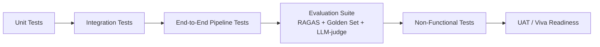

# Solace AI — Testing / QA Plan

> **Document type:** Test Strategy & QA Plan
> **Product:** Solace AI — Clinical-Evidence Research Assistant
> **Status:** Draft v1.0
> **Date:** 2026-06-21
> **Audience:** Engineers, QA, reviewers, evaluation committee

---

## 1. Objectives

Validate that Solace AI produces **faithful, cited, correctly-graded, and appropriately-abstaining** evidence documents, that the **multi-agent pipeline degrades gracefully**, and that **governance/provenance** is complete and reproducible.

### Quality goals being tested

1. **Faithfulness** — claims supported by retrieved source text.
2. **Citation accuracy** — citations point to the correct support.
3. **Calibrated abstention** — abstain when thin, answer when sufficient.
4. **No hallucinated graph relations** — corroboration gate holds.
5. **Graceful degradation** — failure paths behave as designed.
6. **Provenance completeness & reproducibility** — pinned versions, full audit trail.

---

## 2. Test Strategy Overview

| Layer | What it covers | Tooling |
|---|---|---|
| Unit | Individual agent logic, parsers, schema validation | pytest |
| Integration | Agent ↔ retrieval/graph/DB; LangGraph state transitions | pytest + test containers |
| End-to-end | Full query → document workflow | pytest + seeded corpus |
| Evaluation | Faithfulness, citation, relevancy, abstention | RAGAS, PubMedQA golden set, LLM-as-judge |
| Non-functional | Latency/cost measurement, observability, resilience | Load harness, chaos tests |
| UAT | Researcher-facing acceptance | Manual + scripted scenarios |

---

## 3. Test Types & Coverage

### 3.1 Unit tests (per agent)

| Agent | Key cases |
|---|---|
| Researcher | Decomposition produces ≥1 sub-question; entity tagging present |
| Retriever | Hybrid fusion ordering; **degraded mode** on simulated API failure sets flag |
| Graph-Builder | Coverage check returns gaps; extraction yields candidate relations only |
| Corroborator | Unsupported relation **dropped** (not down-weighted); supported relation kept |
| Fact-Checker | Correct grade assignment; abstention triggered on thin support |
| Synthesizer | Uses **only** verified claims; never references dropped/candidate material |
| Editor | Citation consistency; provenance attached to every claim; export well-formed |

### 3.2 Integration tests

- Retriever ↔ Vector DB (Qdrant/Weaviate) hybrid search returns ranked passages.
- Graph-Builder ↔ public KG (Hetionet/PrimeKG) coverage check.
- Corroborator ↔ large Groq model client (mocked + live).
- Orchestrator ↔ PostgreSQL: claims, citations, provenance, stage_logs persisted.
- LangGraph **checkpoint recovery**: kill a downstream stage, confirm upstream not re-run.

### 3.3 End-to-end pipeline tests

Full `POST /queries` → poll → `GET /document` against a seeded corpus, asserting evidence-table structure, citations, grades, abstentions, and provenance.

---

## 4. Evaluation Suite (the core of QA for an AI system)

### 4.1 RAGAS metrics

| Metric | Measures | Pass condition |
|---|---|---|
| Faithfulness | Claims grounded in retrieved text | Tracked per sprint; trend ↑, no regression |
| Citation accuracy | Citation → correct source | Trend ↑ |
| Answer relevancy | Output addresses question | Stable/↑ |
| Calibrated abstention | Abstains iff evidence thin | Validated on known-answer cases |

### 4.2 PubMedQA golden regression set (locked)

- Used **strictly as regression ground truth** — no new human labels created.
- Run every sprint; **no accuracy regression** sprint-over-sprint is the gate.

### 4.3 LLM-as-judge (live open-ended queries)

- PubMedQA does not generalize to live open-ended queries → live queries scored by **LLM-as-judge**, with this generalization gap **explicitly documented** as a limitation.

### 4.4 DSPy optimization validation

- After each DSPy prompt/pipeline optimization pass, **re-run the golden set** to confirm improvement and pin the new prompt versions.

---

## 5. Key Test Scenarios (Major Flows)

| # | Scenario | Expected result |
|---|---|---|
| TC-01 | Well-supported question | Evidence table with strong/moderate grades + citations |
| TC-02 | No-evidence question | Explicit abstention; **no fabricated citation** |
| TC-03 | Conflicting sources | Claim graded `contested`; both sides cited |
| TC-04 | PubMed API down | Degraded mode; `live_retrieval_unavailable` flag in output |
| TC-05 | Multi-hop question (gene→…→drug) | Graph reasoning used; corroborated relations only |
| TC-06 | Graph gap + corroboration fails | Falls back to flat vector RAG for that sub-question |
| TC-07 | Hallucination attempt (relation absent in text) | Relation dropped at corroboration gate |
| TC-08 | Provenance audit | Every claim has agent/prompt-version/model/retrieval-pass |
| TC-09 | Export | Valid Markdown + PDF with consistent citations |
| TC-10 | Reproducibility | Same pinned versions → consistent regression results |
| TC-11 | Mid-pipeline stage failure | Resume from checkpoint; upstream not re-run |
| TC-12 | Login with correct/incorrect password | Correct → access+refresh JWT; incorrect → 401, no token |
| TC-13 | Protected endpoint without/with bad/expired token | 401 in every case; no business logic runs |
| TC-14 | Researcher hits admin-only endpoint | 403 |
| TC-15 | Researcher requests another user's query/export | 403 (ownership check) |
| TC-16 | Admin **monitors** any user's data (read) + uses admin endpoints | 200 (read-only oversight) |
| TC-17 | Register with `role:"admin"` in body; password-hash exposure | Role ignored (forced `researcher`); no hash in any response |
| TC-18 | **Admin attempts to submit a query** (`POST /queries`) | **403** (separation of duties — querying is researcher-only) |

### 5.1 Requirement Traceability Matrix

Maps each test case back to the PRD's Functional (FR) and Non-Functional (NFR) Requirements, so coverage is auditable.

| Test case | Covers FR | Covers NFR |
|---|---|---|
| TC-01 | FR-3, FR-8, FR-11, FR-12 | NFR-1 |
| TC-02 | FR-9 | NFR-3 |
| TC-03 | FR-8, FR-10 | NFR-1 |
| TC-04 | FR-4 | NFR-4 |
| TC-05 | FR-5, FR-6 | NFR-2 |
| TC-06 | FR-7 | NFR-4 |
| TC-07 | FR-6 | NFR-2 |
| TC-08 | FR-14, FR-17 | NFR-6 |
| TC-09 | FR-15 | NFR-12 |
| TC-10 | FR-18 | NFR-7 |
| TC-11 | FR-16 | NFR-4 |
| TC-12 | FR-19 | NFR-14, NFR-16 |
| TC-13 | FR-20 | NFR-14 |
| TC-14 | FR-21, FR-22 | NFR-15 |
| TC-15 | FR-21 | NFR-15 |
| TC-16 | FR-21, FR-22 | NFR-15 |
| TC-17 | FR-21, FR-23 | NFR-15, NFR-16 |
| TC-18 | FR-24 | NFR-15 |
| Observability assertions (§6) | — | NFR-5 |
| Latency/cost measurement (§6) | — | NFR-8 |
| Statelessness check (§6) | — | NFR-11 |

> **Infra note:** non-functional latency/token-cost tests run against the Render deployment with Groq inference; the chaos suite additionally simulates **Groq rate-limiting / 5xx and timeouts** (Ops §9) to confirm backoff-retry and small-model fallback behave, and **Render cold-start** to confirm graceful recovery.

---

## 6. Non-Functional Testing

| Aspect | Approach |
|---|---|
| **Latency/cost** | Measure p50/p95 latency and per-query **Groq token cost**; **report, not gate** (Groq latency is low) |
| **Observability** | Assert per-agent logs capture latency, token cost, retrieval hit rate, cache hit rate |
| **Resilience / chaos** | Inject PubMed failures, **Groq 429/5xx/timeouts**, graph gaps; confirm backoff-retry, small-model fallback, and degradation paths |
| **Concurrency** | Multiple simultaneous queries don't corrupt shared/session state |
| **Statelessness** | Confirm session graph discarded after query (no cross-session leakage) |
| **Security (AuthN/Z)** | JWT tamper/expiry rejection; RBAC matrix (researcher vs admin); ownership isolation between users; password hashing (no plaintext/hash leakage); `JWT_SECRET` absent from repo/logs |

---

## 7. Test Data

| Source | Use |
|---|---|
| PubMedQA | **Locked golden regression set** + abstention calibration (known answers) |
| MedQuAD | Indexed corpus retrieval tests |
| Live PubMed (E-utilities) | Live-query + degradation tests (and mocked failures) |
| Hetionet / PrimeKG | Graph coverage + multi-hop tests |
| Synthetic adversarial set | Hallucination-gate tests (relations absent from text) |

---

## 8. Entry / Exit Criteria

**Entry:** corpus indexed, models served, pipeline wired, golden set loaded.

**Exit (per sprint):**
- All P0 unit + integration tests pass.
- E2E happy path + abstention + degradation scenarios pass.
- RAGAS metrics captured; **PubMedQA regression: no regression**.
- 100% provenance completeness on sampled outputs.
- Known limitations (latency/cost, generalization, corpus bias) documented.

---

## 9. Defect Management

| Severity | Definition | Example |
|---|---|---|
| S1 (blocker) | Defensibility or security broken | Fabricated citation; uncorroborated relation in output; **auth bypass / RBAC escalation / cross-user data leak** |
| S2 (major) | Degradation/abstention misbehaves | Doesn't flag degraded mode; abstains when evidence sufficient |
| S3 (minor) | Formatting/UX | Citation formatting inconsistency |
| S4 (trivial) | Cosmetic | UI copy |

S1/S2 block sprint exit. Each fix adds a regression test.

---

> **Next**: Reply "continue" to generate the next document.
